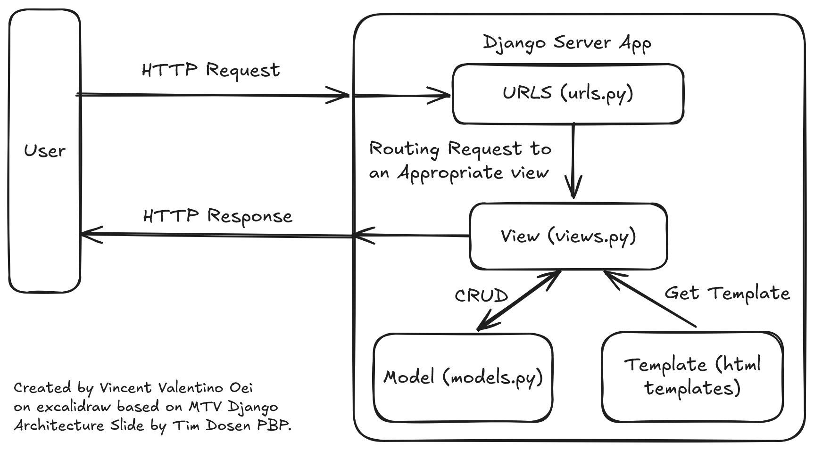

# Flystep
A Simple Online Shopping Web App built with Django to fulfill PBP's Assignment Requirements.

The deployment for this project can be found [here](https://vincent-valentino-flystep.pbp.cs.ui.ac.id).

---

## Jawaban Tugas

### 1. Cara penyelesaian checklist
- Menentukan tema kecil, akhirnya menetapkan tema kecil pada pakaian dan sepatu dalam olahraga.
- Membuat sebuah directory baru, disini saya beri nama flystep, sama dengan nama project yang digunakan.
- Inisialisasi git di root project ini
- Inisialisasi virtual env menggunakan venv (di root project ini juga)
- Copy .gitignore dan requirements.txt dari project tutorial, karena isi kedua file ini seharusnya serupa, dan tidak terlalu penting (untuk pembelajaran).
- Membaca beberapa docs dari UI library yang menyediakan CDN untuk penggunaan langsung, memutuskan untuk memilih daisyui karena mudah.
- Start django project, pada root directory project ini, dengan nama yang sama dengan nama directory project ini.
- Start django app, dengan nama main sesuai keperluan soal dan konvensi.
- Menambahkan sebuah model sesuai keperluan soal ditambahkan stok, created, dan updated at (sering digunakan, ini utk future proof)
- Membuat sebuah template baru di dalam aplikasi main dan mencoba menggunakannya melalui penambahan fungsi render_main pada views.py dan inklusi path tersebut pada main.urls, dan registrasi pada flystep.urls.
- Register model pada main.admin, namun tidak berhasil, menemukan referensi dari stackoverflow, mengganti `admin.register(Product)` menjadi `admin.site.register(Product)`.
- Menambahkan produk melalui django admin (pada sqlite).
- Menambahkan context pada fungsi render_main dan menambahkan penggunaannya pada template main.html.
- Mengubah theme yang digunakan pada template main.html

### 2. Bagan lifecycle request dalam Django

Django menganut arsitektur MTV (Model Template View). Intinya suatu request akan diroute oleh file `urls.py` ke view yang sesuai, kemudian view tersebut dapat melakukan CRUD (Create Read Update Delete) (opsional) melalui model, dan dapat mengambil template yang diperlukan dan mempopulasinya sesuai dengan konteks yang diberikan dan keperluan template (opsional) sehingga menghasilkan suatu http response yang akan diterima oleh user.

### 3. Fungsi git dalam pengembangan perangkat lunak
Git awalnya dikembangkan oleh Linus Torvalds (Tokoh legend 🥶🥶🥶) untuk manajemen pekerjaannya dalam Linux. Sekarang ini git hampir tidak dapat terlepas dari kehidupan kita sebagai pengembang perangkat lunak dikarenakan kemampuannya untuk melakukan version controlling dan membuat pekerjaan beberapa orang secara parallel dalam satu codebase mungkin, meninggalkan masa dimana kita harus saling membagi USB untuk bekerja sama dan kita harus selalu menyimpan backup setiap versi kode kita untuk melakukan rollback dengan cepat.

### 4. Alasan penggunaan Django pada PBP
Saya dapat mengemukakan beberapa asumsi untuk hal ini, seperti penggunaan bahasa yang sama, yakni python pada DDP 1, sehingga ketika mahasiswa berhadapan dengan PBP, setidaknya mahasiswa tidak perlu mempelajari bahasanya lagi dari awal, namun hanya perlu mempelajari toolsnya. Selain itu, opsi lain seperti laravel, dan php yang digunakan sebelumnya ditinggalkan berdasarkan konsiderasi tren pasar dan alasan keamanan. Namun menurut saya, terdapat banyak javascript framework yang lebih suitable untuk pbp dengan alasan teknologi yang lebih modern dan tren pasar yang semakin meningkat, seperti Nextjs, SvelteKit, Astro.

### 5. Model Django adalah ORM
Apa itu ORM? ORM adalah singkatan dari Object Relational Mapping. Membuat kita dapat melakukan operasi pada data selayaknya objek dan ORM django (model) yang akan mengubah setiap operasi kita menjadi operasi yang kompatibel dengan relational database, dengan kata lain, ORM akan menjadi translator antara setiap operasi kita dengan bahasa sql yang digunakan pada relational database seperti postgresql, sqlite, mysql, dan lain-lain. Contoh lain dari ORM adalah prisma yang cukup terkenal terutama di kalangan fullstack js app developer. 

---

Thank you for reading this far!
