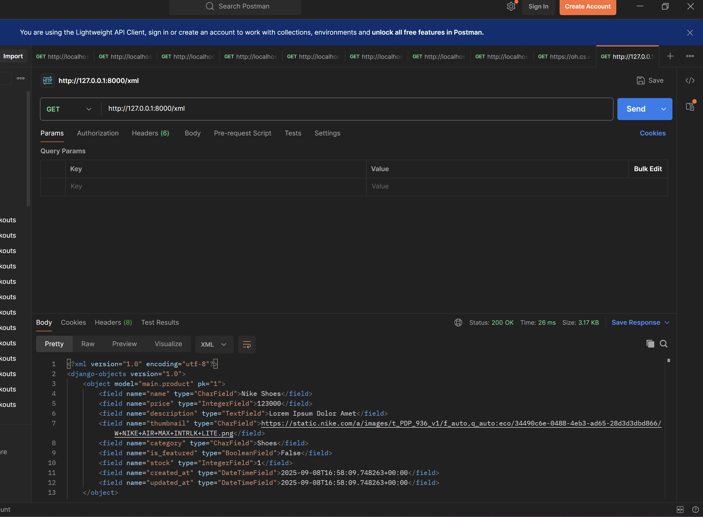

# Flystep
A Simple Online Shopping Web App built with Django to fulfill PBP's Assignment Requirements.

The deployment for this project can be found [here](https://vincent-valentino-flystep.pbp.cs.ui.ac.id).

---

# Jawaban Tugas

## Tugas 2

Jawaban tugas 1

### 1. Cara penyelesaian checklist
- Menentukan tema kecil, akhirnya menetapkan tema kecil pada pakaian dan sepatu dalam olahraga.
- Membuat sebuah directory baru, disini saya beri nama flystep, sama dengan nama project yang digunakan.
- Inisialisasi git di root project ini
- Inisialisasi virtual env menggunakan venv (di root project ini juga)
- Copy .gitignore dan requirements.txt dari project tutorial, karena isi kedua file ini seharusnya serupa, dan tidak terlalu penting (untuk pembelajaran).
- Membaca beberapa docs dari UI library yang menyediakan CDN untuk penggunaan langsung, memutuskan untuk memilih daisyui karena mudah.
- Start django project, pada root directory project ini, dengan nama yang sama dengan nama directory project ini.
- Start django app, dengan nama main sesuai keperluan soal dan konvensi.
- Menambahkan sebuah model sesuai keperluan soal ditambahkan stok, created, dan updated at (sering digunakan, ini utk future proof)
- Membuat sebuah template baru di dalam aplikasi main dan mencoba menggunakannya melalui penambahan fungsi render_main pada views.py dan inklusi path tersebut pada main.urls, dan registrasi pada flystep.urls.
- Register model pada main.admin, namun tidak berhasil, menemukan referensi dari stackoverflow, mengganti `admin.register(Product)` menjadi `admin.site.register(Product)`.
- Menambahkan produk melalui django admin (pada sqlite).
- Menambahkan context pada fungsi render_main dan menambahkan penggunaannya pada template main.html.
- Mengubah theme yang digunakan pada template main.html
- Menambahkan beberapa product melalui `python manage.py shell` di PWS.
- Walaupun app benar, sadar kesalahan pengerjaan jawaban tugas di readme ini (Harusnya ganjil 2026, malah kerjain ganjil 2025)
  
- Revisi Jawaban dalam Readme ini

### 2. Bagan lifecycle request dalam Django

Django menganut arsitektur MTV (Model Template View). Intinya suatu request akan diroute oleh file `urls.py` ke view yang sesuai, kemudian view tersebut dapat melakukan CRUD (Create Read Update Delete) (opsional) melalui model, dan dapat mengambil template yang diperlukan dan mempopulasinya sesuai dengan konteks yang diberikan dan keperluan template (opsional) sehingga menghasilkan suatu http response yang akan diterima oleh user.

### 3. Peran settings.py dalam proyek Django
seperti namanya, [settings.py](./flystep/settings.py) berisi berbagai pengaturan yang bersangkutan dengan aplikasi kita seperti installed apps, middleware, pengaturan behaviour aplikasi (allowed hosts, debug mode, dsb), database, i18n, logging, dan banyak lainnya. Intinya file ini berguna dalam pengaturan perilaku aplikasi secara keseluruhan.

### 4. Cara kerja migrasi Django
Migrasi dalam konteks ini adalah sebuah cara untuk melakukan update kepada schema database kita mengikuti model yang ada. Tentunya setiap kali kita melakukan update pada model kita, migrasi perlu dilakukan untuk sync schema database dan model kita. Dalam Django sendiri untuk melakukan migrasi, kita dapat menjalankan `python manage.py makemigrations` untuk membuat file migrasi yang diperlukan (umumnya dalam bentuk file sql, isinya berbagai macam perintah seperti alter, create, delete, dsb) dan `python manage.py migrate` untuk mengaplikasi migrasi tersebut kepada relational database kita. 

### 5. Alasan penggunaan Django pada PBP
Saya dapat mengemukakan beberapa asumsi untuk hal ini, seperti penggunaan bahasa yang sama, yakni python pada DDP 1, sehingga ketika mahasiswa berhadapan dengan PBP, setidaknya mahasiswa tidak perlu mempelajari bahasanya lagi dari awal, namun hanya perlu mempelajari toolsnya. Selain itu, opsi lain seperti laravel, dan php yang digunakan sebelumnya ditinggalkan berdasarkan konsiderasi tren pasar dan alasan keamanan. Namun menurut saya, terdapat banyak javascript framework yang lebih suitable untuk pbp dengan alasan teknologi yang lebih modern dan tren pasar yang semakin meningkat, seperti Nextjs, SvelteKit, Astro.

### 6. Feedback untuk asisten dosen tutorial sebelumnya
Sudah cukup baik, walaupun secara online, asisten dosen selalu tersedia di voice channel di discord dan sangat mudah mendapatkan bantuan apabila diperlukan. Dalam pengerjaan tutorial sebenarnya terlalu banyak yang diberikan kepada mahasiswa, sehingga kami seperti tinggal melakukan copy and paste terhadap dokumennya mengingat constraint waktu. Namun setelah dibaca kembali, saya rasa website pbp ini sangat informatif dan sangat dapat digunakan terutama dalam pembelajaran ulang.

---

## Tugas 3

Jawaban Tugas 3

### 1. Keperluan Data Delivery Dalam Implementasi Sebuah Platform
Suatu aplikasi memerlukan data delivery sebagai penyokong fungsionalitas tambahan, tanpa data delivery, suatu website hanya bisa menampilkan static page. Data delivery sangat diperlukan untuk melakukan CRUD pada aplikasi secara langsung, pengeksposan REST API untuk konsumsi eksternal dan lain-lain.

### 2. XML vs JSON sebagai response API
Dari opini dan pengetahuan saya secara pribadi, JSON dan XML cukup setara dalam pengiriman data, namun secara kecepatan dan densitas data JSON menang jauh dibandingkan XML. Untuk sebuah objek dalam representasi XML, dibutuhkan 2 kali panjang setiap nama key karena membutuhkan opening dan closing tag untuk setiap atribut, sedangkan untuk json sendiri, hanya diperlukan key value pair dalam bentuk yang mirip dengan javascript object(javascript object notation). Secara kecepatan, JSON lebih cepat dibanding XML karena struktur yang didukung lebih sederhana, namun dapat memenuhi mayoritas kebutuhan developer, selain itu JSON juga sebenarnya sangat mirip dengan JS, sehingga membuat para developer lebih familiar. Maka menurut saya, JSON lebih unggul.

### 3. Fungsi form.is_valid() dalam Django
Fungsi dari method is_valid sama seperti namanya, mengecek apakah sebuah form valid, jika input yang diberikan (umumnya dengan `Form(request.POST or None)`) merupakan data yang valid untuk form terkait. Selain itu, method ini juga melakukan validasi terhadap masukkan-masukkan yang ada untuk setiap kolom data yang muncul pada form tersebut dan akan mengembalikan error-error pada data tersebut jika ada (seperti validasi input yang harusnya angka, tanggal, radio button, dsb).

### 4. Kegunaan CSRF_TOKEN pada form di Django
Sesuai dengan kepanjangan CSRF yakni _cross site request forgery_, token ini ada untuk menghentikan penyerangan pada website kita dari website lain, yakni ketika website asing membuat sebuah post request ke website kita, jika seseorang masih logged in di website kita, maka tanpa csrf token, request jahat dari website asing tersebut dapat masuk ke website kita dan melakukan aksi sebagai user tersebut.

### 5. Cara Implementasi Checklist untuk Tugas 2
- Melakukan `git reset --hard` dan menghapus file2 yang dibuat pada demo
- Mengorganisir file asset dalam repo tugas ini untuk mengakomodir tugas-tugas berikutnya
- Menambahkan view untuk api xml dan json
- Menambahkan routing untuk view-view yang baru dibuat
- Menambahkan view dan route untuk pembuatan produk
- Menambahkan form untuk produk
- Menambahkan template `create_product.html`
- Menambahkan view, routing, serta template `details.html`
- Melakukan dokumentasi pemanggilan API pada route xml dan json

### 6. Feedback
-

### 7. Dokumentasi pemanggilan API XML dan JSON

---

## Tugas 4

Jawaban tugas 4

### 1. Django Authentication form beserta plus minusnya
Sebuah form built-in milik django untuk melakukan otentikasi terhadap user. Dengan adanya form ini, kita dapat dengan mudah membuat sebuah form baru, dengan `{{form.as_table}}` atau sebagainya. Form ini sepaket dengan model user dan registration form yang dimiliki django (berasal dari django.contrib.auth), semua ini membantu memudahkan pengembangan aplikasi, tetapi sangat mengorbankan fleksibilitas (seperti untuk menambahkan field dan mengubah UI).

### 2. Otentikasi vs Otorisasi
Otentikasi contohnya adalah seorang user login, berarti mencakup tentang proses verifikasi siapa user itu
Otoriasasi contohnya melalui decorator login_required, memastikan apakah seorang user memiliki izin yang cukup.

Adapun Django memberikan module `django.contrib.auth` untuk memudahkan kita. Otentikasi dapat dilakukan dengan menggunakan `AuthenticationForm` dan `UserCreationForm`, sedangkan otorisasi dapat digunakan dengan decorator seperti `login_required` maupun `permission_required(NAMA_PERMISSION)`.

### 3. Session vs Cookie dalam penyimpanan state
Data dalam session adalah data yang disimpan di dalam server dimana kita memiliki sessionIdnya, dan data dalam cookie adalah data yang ada dalam komputer kita dan dikirimkan setiap request menuju server. Umumnya session digunakan untuk data-data yang lebih sensitif dan cookie digunakan untuk data yang kurang sensitif, karena lebih rentan terkena serangan. 

### 4. Keamanan Cookies
Tidak aman tanpa pengaturan yang tepat, rentan terhadap XSS, CSRF, dkk. Django menyediakan beberapa pengaturan dalam `settings.py` untuk menghindari serangan-serangan ini, antara lain `SESSION_COOKIE_SECURE` dan `CSRF_COOKIE_SECURE`.

### 5. Checklist
- Memperbaiki error2 yang ada sebelumnya
- Membuat foreign relation ke user dari model product
- Membuat migrasi yang diperlukan dan melakukan migrasi
- Membuat view register, login, dan logout sambil membuat template yang diperlukan dari template2 sebelumnya
- Menambahkan cookie ketika login dan menghilangkannya ketika logout
- Menambahkan decorator login_required ke endpoint main dan create product.
- Menambahkan informasi tentang user di create product dan menambahkan informasi last login di main page.
- Menambahkan dummy product dan dummy user

---

## Tugas 5

Jawaban Tugas 5

### 1. Urutan Prioritas CSS Selector
Ditentukan dengan konsiderasi spesifisitas dan urutan kode ketika terjadi tie. Dari spesifisitas tertinggi hingga terendah: Inline css, ID selector, Class/pseudo-class/attribute selector, dan tag selector.
Adapun suatu keyword lain dalam CSS yang dapat digunakan untuk meningkatkan prioritas suatu properti dalam sebuah selector, yakni `!important`, ini akan mengalahkan spesifisitas yang lain, namun jika terjadi tie, akan tetap dilakukan tie breaker dengan memerhatikan urutan (yang terakhir yang digunakan).

### 2. Pentingnya Responsive Design
Responsive design memudahkan pengguna mengakses website kita dalam berbagai form factor, kita juga tidak perlu membuat 2 aplikasi yang sepenuhnya berbeda untuk berbagai device, hanya perlu satu website yang responsif. Website yang responsive juga meningkatkan UX dan juga SEO. Contoh web yang telah menerapkan ini misalnya Instagram dan Tokopedia, contoh web yang masih belum menerapkannya misalnya SiakNG, perbedaan terbesarnya adalah pengalaman pengunaan pada mobile device, web seperti SiakNG harus di zoom dan banyak digerakan, karena dibuat bukan untuk pengguna mobile.

### 3. Margin, Border, dan Padding

Sesuai gambar diatas, Margin, Border dan Padding menyusun sesuatu yang dinamakan Box Model. Margin merupakan ruang di luar elemen, border merupakan ruang tepat pada pembatas elemen, dan padding merupakan ruang di dalam elemen, di antara konten dan border.

### 4. Flex dan Grid
Flexbox sangat baik dalam menata elemen yang ingin disusun dalam 1 dimensi, seperti menjadi sebuah barisan maupun kolom, flexbox memberikan kemampuan bagi direct childrennya untuk melakukan resizing dan repositioning seperlunya, contoh penggunaannya adalah navbar. Sedangkan Grid sangat baik dalam menata elemen dalam struktur 2 dimensi, seperti galeri, bento-style, dsb yang lebih teratur. 

### 5. Checklist
- Instalasi whitenoise dan setup static folder
- Membuat view baru untuk page edit dan delete
- Menambahkan property untuk model product, agar formatting harga menjadi lebih sederhana.
- Mengembangkan tampilan dan mencari stock image yang sesuai untuk aplikasi.

---

## Tugas 6

Jawaban Tugas 6

### 1. Perbedaan Sync & Async Request
Sync akan menghasilkan behaviour blocking, sedangkan Async akan menghasilkan behavious non-blocking, artinya, ketika kita melakukan sync request, browser akan "hang" sampai request terpenuhi, sedangkan ketika kita melakukan async request, browser akan tetap responsif sambil menunggu hasil request tersebut.

### 2. Alur Kerja AJAX di Django

Awalnya Akan dilakukan fetch seperti normal, namun untuk pembaruan laman, dilakukan melalui AJAX, hampir setiap aksi user akan dilakukan melalui ajax: dipicu user, kemudian melalui javascript, browser akan hit API dari app, kemudian menunggu respons (non-blocking), dan akhirnya memperbarui tampilan.

### 3. Keuntungan Penggunaan AJAX Dibanding Render Biasa Django
Render biasa perlu melakukan render ulang sepenuhnya ke sebuah webpage ketika ada komponen yang berubah, sehingga membuat response time semakin lambat, selain itu, dengan adanya AJAX, aplikasi web menjadi lebih interaktif, setiap aksi hanya perlu berinteraksi dengan API dengan medium yang ringan seperti JSON, memungkinkan aksi-aksi kecil mendapatkan feedback jauh lebih cepat dari biasanya. 

### 4. Memastikan keamanan Endpoint Register dan Login dengan AJAX
Tentunya kita dapat menggunakan csrf token kembali untuk menghentikan serangan cross site scripting, selain itu, validasi input harus selalu dilakukan pada client dan server untuk menjaga pengalaman pengguna yang baik.

### 5. Pengaruh AJAX Terhadap UX
Website terasa lebih cepat dan responsif, interaksi menjadi lebih cepat dan natural, namun penanganan akan error-error yang muncul dari endpoint harus diterapkan dengan baik, jika tidak, pengalaman pengguna akan menurun jauh (dapat diimplementasikan dengan toasts, dsb). 

---

Thank you for reading this far!

